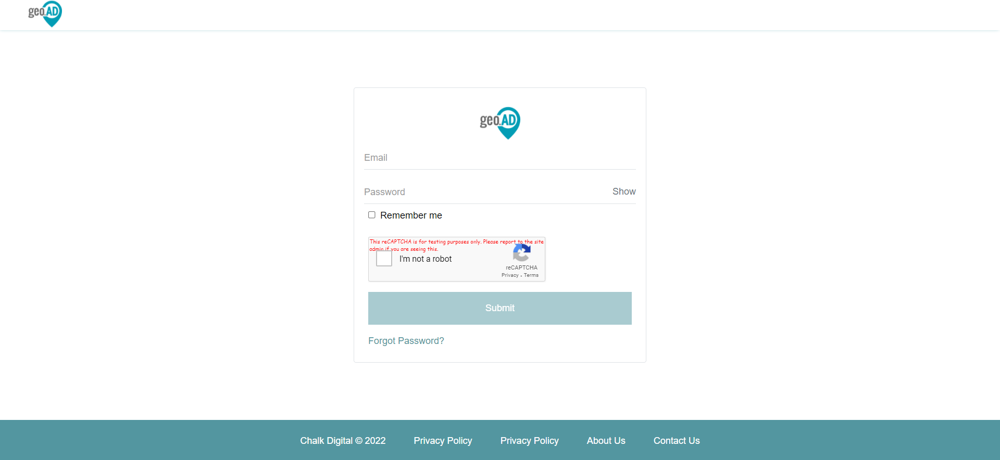

## Publish React components as an npm package

###   Pre-conditions:
> Create an npm account and login. You can either login from the npm website or from the CLI by running npm login.

> A React app. I created the boilerplate for this article with npx create-react-app npm-test. Run the app on your local machine.

### 1. Create and isolate components to publish

In the boilerplate app, I went into the src folder and deleted everything besides App.js, app.css, and index.js.
I also added a folder called lib that will store everything I want to publish on npm. Inside lib , there is a folder called components to store the component elements and a file called index.js to export them.

Inside the components folder, I create new files called, which will be the components to use from the npm package. 

These components are both in the components folder. Then, we’ll add them to the index.js file outside components folder:

importLogin from './components/Login';

export {Login };

### 2. Install Babel and build the dist folder
To install Babel, run the following in the CLI:
  `npm install --save-dev @babel/core @babel/cli @babel/preset-env`
  `npm install -save @babel/polyfill`

### In the top-level folder of your project, add a file called babel.config.json and add the following presets:

`{
 "presets": [
  [
   "@babel/env",
    {
     "targets": {
     "edge": "17",
     "firefox": "60",
     "chrome": "67",
     "safari": "11.1"
      },
   "useBuiltIns": "usage",
   "corejs": "3.6.5"
    }
],
   "@babel/preset-react"
]
}`

**Note: @babel/env tells the browser which versions it should target, and @babel/preset-react allows Babel to compile JSX**

In package.json , under scripts, replace the build script with the following:

` "build": "  babel src/lib -d dist --copy-files",`
or

` "build": "rm -rf dist && NODE_ENV=production babel src/lib --out-dir dist --copy-files";`

This will copy the src/lib to a new folder called dist . This folder is invisible but will be added to your root folder after build.
Run the command npm run build in the CLI.
If your build was successful and you write ls -a in the root folder, you will see a new folder called dist :

### 3. Alter the package.json for publishing

This is the good part! The package.json must be changed to publish to npm.

This is the first part of my package.json:

`"name": "npm-test",`
` "version": "0.1.0",`
`"private": true,`

The name here has to be a unique name that hasn’t been taken by an existing npm package (you can check if a name is taken using npm search). version is the package version, and must be changed whenever it’s republished. Version syntax indicates major, minor, and patch releases and more about it can be found here in the npm docs.
description, keywords, and author are all optional fields that will give potential end users a better idea of the package. Full package.json here.

`"name": "chalk-iriaresearch`
`"description": "Two test React components",`
`"author": "",`

`"version": "0.1.0",`
`"private": false,`
`"main": "dist/index.js",`
`"module": "dist/index.js",`
`"files": [ "dist", "README.md" ],`
`
The file is ready for npm publish.

### 4. Use the new package
Check in the CLI and on your npm profile that the package has published. To make sure it’s working, open a different project on your local machine, and try to use the package:
npm install chalk-iriaresearch
In the new project, try to use one of your components by importing it:

> App.js
import { Main } from 'chalk-iriaresearch';

function App() {
return (
  <Flex >
   <h3>This is my new project</h3>
   <Main/>
  </Flex>
);
}
export default App;

In the browser, we see:

## How to use It 
 **Note: This is our tag of npm package**
 `<Main/>`

`import {Main} from  'chalk-iriaresearch'`

`import data from '../node_modules/chalk-iriaresearch/dist/componants/data.json'`

`function App() {`
 
  `return (`

    `<>`

      `
`

       `<Main

          props={

            (data.content = {

              SERVICE_API: " ",

              FOGOT_PASSWORD: "",

              UPDATE_PASSWORD: "",

              LOGIN_API: "",

              SITE_LOGO: "",

              GOOGLE_RECAPTCH_ID: "",

              ISCAPTCHER_ENABLED: "",

              HEADER_BG_COLOR: "",

              FOOTER_BG_COLOR: "",

              FOOTER_FONT_COLOR: "",

              BODY_BG_COLOR: "",

              BODY_FONT_COLOR: "",

              CONTACT_API: "",

              PROVIDER: "",

              PORTALNAME: "",

              APP_NAME: "",

              APP_NAME_SH: "",

              ABOUT_US: "",

              ABOUT_US_ISENABLED: "",

              CONTACT_US: "",

              CONTACT_US_ISENABLED: "",

              NAME: "",

              PRIVACY_POLICY: "",

              PRIVACY_POLICY_ISENABLED: "",

              PRIVACY_POLICY_LINK: "",

              TERMS_AND_CONDITIONS: "",

              TERMS_AND_CONDITIONS_ISENABLED: "",

              TERMS_AND_CONDITIONS_LINK:"",

              ABOUT_US_CONTENT:  "",

            })

          }

       />`
      `
`
    `</>`
  `);`
`}`
`export default App;`

### Thses are Our standard parameters to change the data

`
data.content = {

              SERVICE_API: " ",

              FOGOT_PASSWORD: "",

              UPDATE_PASSWORD: "",

              LOGIN_API: "",

              SITE_LOGO: "",

              GOOGLE_RECAPTCH_ID: "",

              ISCAPTCHER_ENABLED: "",

              HEADER_BG_COLOR: "",

              FOOTER_BG_COLOR: "",

              FOOTER_FONT_COLOR: "",

              BODY_BG_COLOR: "",

              BODY_FONT_COLOR: "",

              CONTACT_API: "",

              PROVIDER: "",

              PORTALNAME: "",

              APP_NAME: "",

              APP_NAME_SH: "",

              ABOUT_US: "",

              ABOUT_US_ISENABLED: "",

              CONTACT_US: "",

              CONTACT_US_ISENABLED: "",

              NAME: "",

              PRIVACY_POLICY: "",

              PRIVACY_POLICY_ISENABLED: "",

              PRIVACY_POLICY_LINK: "",
              
              TERMS_AND_CONDITIONS: "",

              TERMS_AND_CONDITIONS_ISENABLED: "",

              TERMS_AND_CONDITIONS_LINK:"",

              ABOUT_US_CONTENT:  "",

 ##  If there is cjs.js error
  run this command in terminal
  `npm install core-js --save `